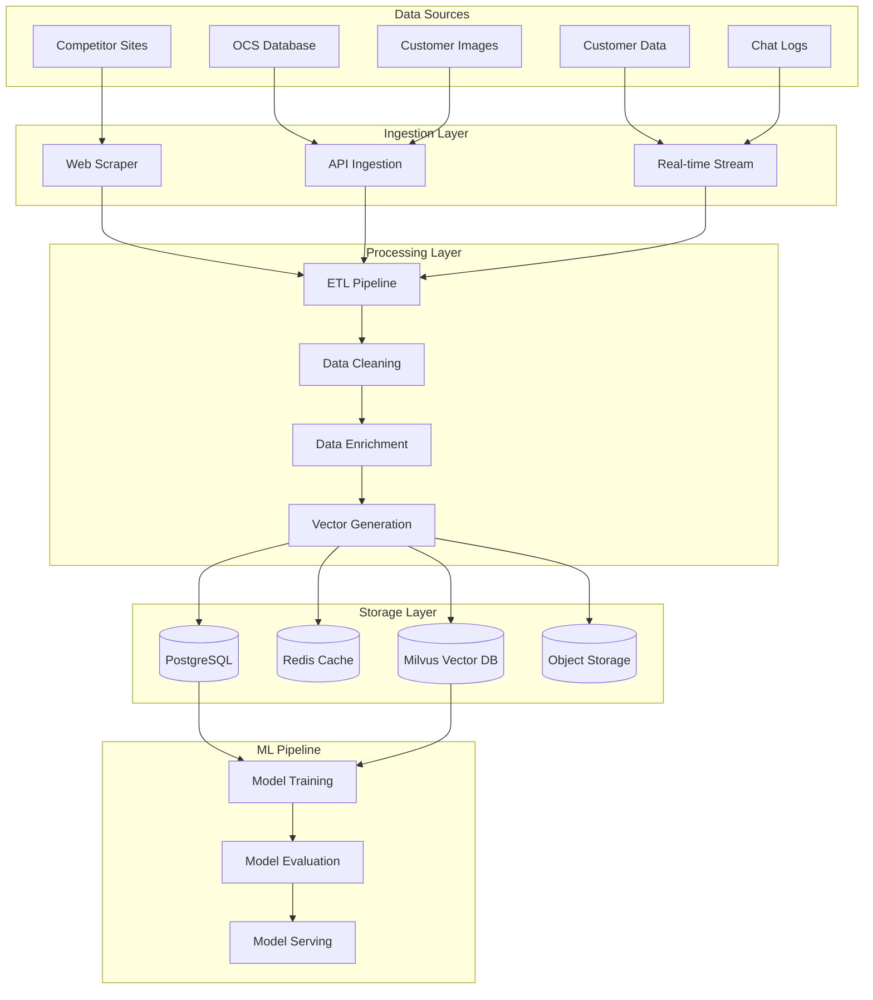

# Data Pipeline Architecture

## Overview
The AI Engine Services data pipeline handles ingestion, processing, storage, and serving of cannabis-related data for ML model training and inference.

## Data Flow Architecture



## Data Sources

### 1. Canadian Cannabis Databases
- **OCS (Ontario Cannabis Store)** product catalog
- **AGLC (Alberta Gaming, Liquor and Cannabis)** data
- **SQDC (Société québécoise du cannabis)** products
- **Provincial regulatory databases**

### 2. Competitor Intelligence
- **Web scraping** from licensed retailers
- **API integrations** where available
- **Product catalogs** and pricing data
- **Inventory status** monitoring

### 3. Customer Data
- **Customer profiles** and preferences
- **Purchase history** and patterns
- **Facial recognition** templates (encrypted)
- **Chat conversations** and feedback

### 4. Real-time Streams
- **Customer interactions** (POS integration)
- **Inventory updates** (real-time stock levels)
- **Price changes** (competitor monitoring)
- **System metrics** and logs

## Data Processing Pipeline

### Phase 1: Data Ingestion

```python
# Example: Canadian Strain Data Ingestion
class StrainDataIngester:
    def __init__(self):
        self.ocs_client = OCSAPIClient()
        self.aglc_scraper = AGLCScraper()
        self.sqdc_client = SQDCClient()
    
    async def ingest_all_sources(self):
        # Parallel ingestion from all sources
        tasks = [
            self.ingest_ocs_data(),
            self.ingest_aglc_data(),
            self.ingest_sqdc_data()
        ]
        
        results = await asyncio.gather(*tasks)
        return self.merge_results(results)
    
    async def ingest_ocs_data(self):
        products = await self.ocs_client.get_all_products()
        return self.normalize_ocs_format(products)
```

### Phase 2: Data Cleaning & Normalization

```python
class DataCleaner:
    def clean_strain_data(self, raw_data):
        cleaned = []
        
        for product in raw_data:
            # Standardize THC/CBD percentages
            thc = self.normalize_percentage(product.get('thc'))
            cbd = self.normalize_percentage(product.get('cbd'))
            
            # Standardize weight units
            weight = self.normalize_weight(product.get('weight'))
            
            # Clean product names
            name = self.clean_product_name(product.get('name'))
            
            # Extract strain type
            strain_type = self.extract_strain_type(product.get('description'))
            
            cleaned.append({
                'name': name,
                'thc_percentage': thc,
                'cbd_percentage': cbd,
                'weight_grams': weight,
                'strain_type': strain_type,
                'brand': product.get('brand'),
                'price': product.get('price'),
                'source': product.get('source')
            })
        
        return cleaned
```

### Phase 3: Data Enrichment

```python
class DataEnricher:
    def __init__(self):
        self.terpene_db = TerpeneDatabase()
        self.genetics_db = GeneticsDatabase()
        self.effects_db = EffectsDatabase()
    
    def enrich_strain_data(self, strain_data):
        enriched = []
        
        for strain in strain_data:
            # Add terpene profiles
            terpenes = self.terpene_db.get_profile(strain['name'])
            
            # Add genetic lineage
            genetics = self.genetics_db.get_lineage(strain['name'])
            
            # Add effect predictions
            effects = self.predict_effects(strain, terpenes)
            
            enriched_strain = {
                **strain,
                'terpene_profile': terpenes,
                'genetic_lineage': genetics,
                'predicted_effects': effects,
                'enriched_at': datetime.utcnow()
            }
            
            enriched.append(enriched_strain)
        
        return enriched
```

### Phase 4: Vector Generation

```python
class VectorGenerator:
    def __init__(self):
        self.text_encoder = SentenceTransformer('all-MiniLM-L6-v2')
        self.multimodal_encoder = CLIPModel.from_pretrained('openai/clip-vit-base-patch32')
    
    def generate_product_vectors(self, products):
        vectors = []
        
        for product in products:
            # Text embedding
            text_desc = self.create_text_description(product)
            text_vector = self.text_encoder.encode(text_desc)
            
            # Feature vector (THC, CBD, terpenes)
            feature_vector = self.create_feature_vector(product)
            
            # Combined vector
            combined_vector = np.concatenate([text_vector, feature_vector])
            
            vectors.append({
                'product_id': product['id'],
                'vector': combined_vector.tolist(),
                'metadata': {
                    'name': product['name'],
                    'thc': product['thc_percentage'],
                    'cbd': product['cbd_percentage'],
                    'strain_type': product['strain_type'],
                    'effects': product['predicted_effects']
                }
            })
        
        return vectors
```

## Storage Architecture

### 1. PostgreSQL - Transactional Data

```sql
-- Products table
CREATE TABLE products (
    id UUID PRIMARY KEY DEFAULT gen_random_uuid(),
    name VARCHAR(255) NOT NULL,
    brand VARCHAR(100),
    sku VARCHAR(50),
    thc_percentage DECIMAL(5,2),
    cbd_percentage DECIMAL(5,2),
    strain_type VARCHAR(20),
    weight_grams DECIMAL(8,2),
    price DECIMAL(10,2),
    source VARCHAR(50),
    created_at TIMESTAMP DEFAULT NOW(),
    updated_at TIMESTAMP DEFAULT NOW()
);

-- Customer profiles
CREATE TABLE customer_profiles (
    id UUID PRIMARY KEY DEFAULT gen_random_uuid(),
    external_customer_id VARCHAR(100) NOT NULL,
    preferred_thc_range NUMRANGE,
    preferred_cbd_range NUMRANGE,
    preferred_strain_types TEXT[],
    purchase_frequency INTEGER,
    avg_spending DECIMAL(10,2),
    created_at TIMESTAMP DEFAULT NOW(),
    updated_at TIMESTAMP DEFAULT NOW()
);

-- Face templates (encrypted)
CREATE TABLE customer_biometrics (
    id UUID PRIMARY KEY DEFAULT gen_random_uuid(),
    customer_id UUID REFERENCES customer_profiles(id),
    encrypted_template BYTEA NOT NULL,
    confidence_score DECIMAL(5,4),
    created_at TIMESTAMP DEFAULT NOW(),
    expires_at TIMESTAMP
);

-- Chat history
CREATE TABLE chat_sessions (
    id UUID PRIMARY KEY DEFAULT gen_random_uuid(),
    customer_id UUID REFERENCES customer_profiles(id),
    session_start TIMESTAMP DEFAULT NOW(),
    session_end TIMESTAMP,
    language VARCHAR(5),
    total_messages INTEGER DEFAULT 0
);

-- Price history
CREATE TABLE price_history (
    id UUID PRIMARY KEY DEFAULT gen_random_uuid(),
    product_id UUID REFERENCES products(id),
    competitor VARCHAR(100),
    price DECIMAL(10,2),
    in_stock BOOLEAN,
    scraped_at TIMESTAMP DEFAULT NOW()
);
```

### 2. Redis - Caching Layer

```python
class RedisCache:
    def __init__(self):
        self.client = redis.Redis(host='redis', decode_responses=True)
    
    # Cache customer recommendations
    async def cache_recommendations(self, customer_id: str, recommendations: List[dict]):
        key = f"recommendations:{customer_id}"
        value = json.dumps(recommendations)
        await self.client.setex(key, 3600, value)  # 1 hour TTL
    
    # Cache face recognition results
    async def cache_face_recognition(self, image_hash: str, customer_id: str):
        key = f"face_recognition:{image_hash}"
        await self.client.setex(key, 300, customer_id)  # 5 minute TTL
    
    # Cache pricing data
    async def cache_competitor_prices(self, product_name: str, prices: dict):
        key = f"competitor_prices:{product_name}"
        value = json.dumps(prices)
        await self.client.setex(key, 1800, value)  # 30 minute TTL
```

### 3. Milvus - Vector Database

```python
class MilvusVectorStore:
    def __init__(self):
        connections.connect(host='milvus', port='19530')
        
        # Product embeddings collection
        self.product_collection = Collection("product_embeddings")
        
        # Customer embeddings collection  
        self.customer_collection = Collection("customer_embeddings")
    
    def create_collections(self):
        # Product embeddings schema
        product_schema = CollectionSchema([
            FieldSchema(name="id", dtype=DataType.VARCHAR, max_length=36, is_primary=True),
            FieldSchema(name="vector", dtype=DataType.FLOAT_VECTOR, dim=768),
            FieldSchema(name="thc_percentage", dtype=DataType.FLOAT),
            FieldSchema(name="cbd_percentage", dtype=DataType.FLOAT),
            FieldSchema(name="strain_type", dtype=DataType.VARCHAR, max_length=20),
            FieldSchema(name="price", dtype=DataType.FLOAT)
        ])
        
        self.product_collection = Collection("product_embeddings", product_schema)
        
        # Create index for fast similarity search
        index_params = {
            "metric_type": "IP",  # Inner Product
            "index_type": "IVF_FLAT",
            "params": {"nlist": 128}
        }
        
        self.product_collection.create_index("vector", index_params)
        self.product_collection.load()
    
    async def search_similar_products(self, query_vector: List[float], top_k: int = 10):
        search_params = {"metric_type": "IP", "params": {"nprobe": 10}}
        
        results = self.product_collection.search(
            data=[query_vector],
            anns_field="vector",
            param=search_params,
            limit=top_k,
            output_fields=["id", "thc_percentage", "cbd_percentage", "strain_type", "price"]
        )
        
        return results
```

## Data Quality & Monitoring

### 1. Data Quality Checks

```python
class DataQualityChecker:
    def validate_strain_data(self, data):
        errors = []
        
        for item in data:
            # Check required fields
            if not item.get('name'):
                errors.append(f"Missing product name: {item}")
            
            # Validate THC/CBD ranges
            thc = item.get('thc_percentage', 0)
            if thc < 0 or thc > 100:
                errors.append(f"Invalid THC percentage: {thc}")
            
            # Validate price
            price = item.get('price', 0)
            if price <= 0:
                errors.append(f"Invalid price: {price}")
        
        return errors
    
    def check_data_freshness(self):
        # Check when data was last updated
        last_update = self.get_last_update_time()
        age_hours = (datetime.utcnow() - last_update).total_seconds() / 3600
        
        if age_hours > 24:
            return f"Data is {age_hours:.1f} hours old"
        
        return "Data is fresh"
```

### 2. Data Lineage Tracking

```python
class DataLineageTracker:
    def track_data_flow(self, source: str, operation: str, output_table: str):
        lineage_record = {
            'timestamp': datetime.utcnow(),
            'source': source,
            'operation': operation,
            'output_table': output_table,
            'record_count': self.count_records(output_table),
            'checksum': self.calculate_checksum(output_table)
        }
        
        self.store_lineage(lineage_record)
    
    def validate_data_integrity(self):
        # Check for data corruption or inconsistencies
        checksums = self.get_all_checksums()
        
        for table, expected_checksum in checksums.items():
            current_checksum = self.calculate_checksum(table)
            
            if current_checksum != expected_checksum:
                self.alert_data_corruption(table)
```

## Batch Processing Jobs

### 1. Daily Strain Data Sync

```python
@schedule.repeat(schedule.every().day.at("02:00"))
async def daily_strain_sync():
    logger.info("Starting daily strain data synchronization")
    
    try:
        # Ingest from all sources
        ingester = StrainDataIngester()
        raw_data = await ingester.ingest_all_sources()
        
        # Clean and enrich
        cleaner = DataCleaner()
        enricher = DataEnricher()
        
        cleaned_data = cleaner.clean_strain_data(raw_data)
        enriched_data = enricher.enrich_strain_data(cleaned_data)
        
        # Generate vectors
        vector_gen = VectorGenerator()
        vectors = vector_gen.generate_product_vectors(enriched_data)
        
        # Store in databases
        await store_products(enriched_data)
        await store_vectors(vectors)
        
        logger.info(f"Synchronized {len(enriched_data)} products")
        
    except Exception as e:
        logger.error(f"Daily sync failed: {e}")
        alert_operations_team(e)
```

### 2. Model Retraining Pipeline

```python
@schedule.repeat(schedule.every().week)
async def retrain_models():
    logger.info("Starting weekly model retraining")
    
    try:
        # Prepare training data
        training_data = await prepare_training_data()
        
        # Retrain recommendation model
        rec_trainer = RecommendationModelTrainer()
        rec_model = await rec_trainer.train(training_data['recommendations'])
        
        # Retrain pricing model
        pricing_trainer = PricingModelTrainer()
        pricing_model = await pricing_trainer.train(training_data['pricing'])
        
        # Evaluate models
        if rec_trainer.evaluate(rec_model) > 0.85:
            await deploy_model(rec_model, 'recommendation')
        
        if pricing_trainer.evaluate(pricing_model) > 0.80:
            await deploy_model(pricing_model, 'pricing')
        
        logger.info("Model retraining completed")
        
    except Exception as e:
        logger.error(f"Model retraining failed: {e}")
        alert_ml_team(e)
```

## Real-time Processing

### 1. Customer Interaction Stream

```python
class CustomerInteractionProcessor:
    def __init__(self):
        self.kafka_consumer = KafkaConsumer('customer_interactions')
        self.profile_updater = CustomerProfileUpdater()
    
    async def process_stream(self):
        async for message in self.kafka_consumer:
            interaction = json.loads(message.value)
            
            # Update customer profile in real-time
            await self.profile_updater.update_preferences(
                interaction['customer_id'],
                interaction['viewed_products'],
                interaction['purchased_products']
            )
            
            # Update recommendation cache
            await self.update_recommendation_cache(interaction['customer_id'])
```

## Data Privacy & Security

### 1. Data Encryption

```python
class DataEncryption:
    def __init__(self, key: bytes):
        self.cipher_suite = Fernet(key)
    
    def encrypt_biometric_template(self, template: np.ndarray) -> bytes:
        # Convert to bytes
        template_bytes = template.tobytes()
        
        # Encrypt
        encrypted = self.cipher_suite.encrypt(template_bytes)
        
        return encrypted
    
    def decrypt_biometric_template(self, encrypted_data: bytes) -> np.ndarray:
        # Decrypt
        template_bytes = self.cipher_suite.decrypt(encrypted_data)
        
        # Convert back to numpy array
        template = np.frombuffer(template_bytes, dtype=np.float32)
        
        return template
```

### 2. Data Retention & Cleanup

```python
class DataRetentionManager:
    async def cleanup_expired_data(self):
        # Remove expired face templates
        await self.cleanup_expired_biometrics()
        
        # Remove old chat history
        await self.cleanup_old_chat_history()
        
        # Remove old price history
        await self.cleanup_old_price_data()
    
    async def cleanup_expired_biometrics(self):
        query = """
        DELETE FROM customer_biometrics 
        WHERE expires_at < NOW()
        """
        
        await self.db.execute(query)
        logger.info("Cleaned up expired biometric templates")
```

## Performance Optimization

### 1. Query Optimization

```sql
-- Indexes for fast lookups
CREATE INDEX idx_products_strain_type ON products(strain_type);
CREATE INDEX idx_products_thc_range ON products USING GIST(numrange(thc_percentage-2, thc_percentage+2));
CREATE INDEX idx_price_history_scraped_at ON price_history(scraped_at DESC);

-- Partitioning for large tables
CREATE TABLE chat_messages (
    id UUID PRIMARY KEY DEFAULT gen_random_uuid(),
    session_id UUID,
    message_text TEXT,
    created_at TIMESTAMP DEFAULT NOW()
) PARTITION BY RANGE (created_at);

-- Monthly partitions
CREATE TABLE chat_messages_2024_01 PARTITION OF chat_messages
FOR VALUES FROM ('2024-01-01') TO ('2024-02-01');
```

### 2. Caching Strategy

```python
class SmartCache:
    def __init__(self):
        self.l1_cache = {}  # In-memory
        self.l2_cache = redis.Redis()  # Redis
    
    async def get_with_fallback(self, key: str):
        # Try L1 cache first
        if key in self.l1_cache:
            return self.l1_cache[key]
        
        # Try L2 cache
        value = await self.l2_cache.get(key)
        if value:
            # Promote to L1
            self.l1_cache[key] = json.loads(value)
            return self.l1_cache[key]
        
        return None
```

This data pipeline architecture ensures high-quality, fresh data for all AI models while maintaining performance, security, and compliance with Canadian privacy regulations.