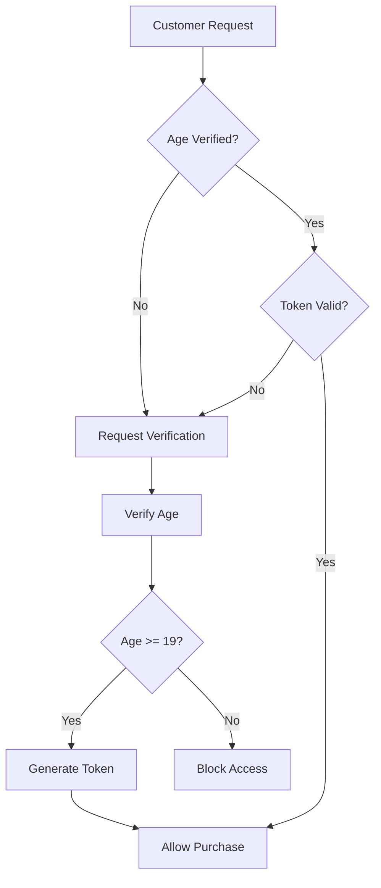

# WeedGo AI Engine - Complete API Documentation

## Table of Contents
1. [Overview](#overview)
2. [Quick Start](#quick-start)
3. [Architecture](#architecture)
4. [API Reference](#api-reference)
5. [Data Models](#data-models)
6. [Integration Guide](#integration-guide)
7. [Performance Optimization](#performance-optimization)
8. [Compliance & Security](#compliance--security)
9. [Troubleshooting](#troubleshooting)
10. [Migration Guide](#migration-guide)

---

## Overview

The WeedGo AI Engine is a production-ready intelligent budtender service that combines advanced AI capabilities with cannabis industry expertise to drive sales through personalized customer experiences.

### Key Features
- 🤖 **Intelligent Conversation**: LLM-powered natural language understanding
- 🎯 **Sales Optimization**: 6-stage SPIN selling methodology
- 🧬 **Scientific Recommendations**: Terpene and cannabinoid-based matching
- ⚡ **High Performance**: Sub-5 second responses with caching
- 🔒 **Compliance Ready**: Age verification and purchase limits
- 📊 **Analytics Built-in**: Conversion tracking and A/B testing
- 🎙️ **Voice Interaction**: Real-time voice with <200ms latency
- 👤 **Voice Identity**: Automatic customer recognition via voice
- 🧠 **Self-Learning**: Improves from every interaction
- 🔄 **True Learning System**: Pattern recognition and prompt evolution

### Service Information
- **Base URL**: `http://localhost:8000`
- **API Version**: `v1`
- **Documentation**: `/api/docs` (Swagger UI)
- **Alternative Docs**: `/api/redoc` (ReDoc)

---

## Quick Start

### Installation

```bash
# Clone repository
git clone <repository>
cd microservices/ai-engine-service

# Install dependencies
pip install -r requirements.txt

# Set up environment
cp .env.example .env
# Edit .env with your configuration

# Download LLM models (if not present)
wget https://huggingface.co/TheBloke/Llama-2-7B-Chat-GGUF/resolve/main/llama-2-7b-chat.Q4_K_M.gguf -P models/
wget https://huggingface.co/TheBloke/Mistral-7B-Instruct-v0.2-GGUF/resolve/main/mistral-7b-instruct-v0.2.Q4_K_M.gguf -P models/

# Set up database
DB_HOST=localhost DB_PORT=5434 DB_NAME=ai_engine DB_USER=weedgo DB_PASSWORD=weedgo123 \
  python scripts/process_ocs_data.py

# Start the service
python api_server.py
```

### First API Call

```bash
# Health check
curl http://localhost:8000/health

# Chat interaction
curl -X POST http://localhost:8000/api/v1/chat \
  -H "Content-Type: application/json" \
  -d '{
    "message": "I need help with sleep problems",
    "customer_id": "test_user"
  }'
```

---

## Architecture

### System Components

```
┌─────────────────────────────────────────┐
│         Frontend Applications            │
│     (Web, Mobile, POS, Kiosks)          │
└──────────────┬──────────────────────────┘
               │ REST API (Port 8000)
┌──────────────▼──────────────────────────┐
│      Unified API Server (api_server.py)  │
│  ┌────────────────────────────────────┐ │
│  │  Request Router & Middleware       │ │
│  └────────────────────────────────────┘ │
└──────────────┬──────────────────────────┘
               │
┌──────────────▼──────────────────────────┐
│         Core Services Layer              │
│  ┌─────────────┐  ┌──────────────┐     │
│  │Model Manager│  │Sales Engine  │     │
│  │(LLMs)       │  │(SPIN Selling)│     │
│  └─────────────┘  └──────────────┘     │
│  ┌─────────────┐  ┌──────────────┐     │
│  │Compliance   │  │Cache Manager │     │
│  │Manager      │  │(Redis)       │     │
│  └─────────────┘  └──────────────┘     │
│  ┌─────────────┐  ┌──────────────┐     │
│  │Error Handler│  │Inference Opt │     │
│  │(Fallbacks)  │  │(Performance) │     │
│  └─────────────┘  └──────────────┘     │
└──────────────┬──────────────────────────┘
               │
┌──────────────▼──────────────────────────┐
│           Data Layer                     │
│  ┌────────────┐  ┌──────────────┐      │
│  │PostgreSQL  │  │Redis Cache   │      │
│  │(Products)  │  │(Sessions)    │      │
│  └────────────┘  └──────────────┘      │
│  ┌────────────┐  ┌──────────────┐      │
│  │Knowledge   │  │Vector Store  │      │
│  │Graph       │  │(Embeddings)  │      │
│  └────────────┘  └──────────────┘      │
└─────────────────────────────────────────┘
```

### Request Flow

1. **Client Request** → API Server
2. **Authentication/Compliance Check** → Middleware
3. **Business Logic** → Service Layer
4. **Data Access** → Database/Cache
5. **Response Generation** → LLM/Templates
6. **Response** → Client

---

## API Reference

### Endpoint Structure

All endpoints follow RESTful conventions and are organized by functional domain:

```
/api/v1/
├── chat/        # AI-powered conversations
├── products/    # Product catalog and search
├── cart/        # Shopping cart management
├── compliance/  # Age verification and regulations
├── analytics/   # Metrics and insights
└── admin/       # Administrative functions

/api/voice/
├── status       # Voice system status
├── configure    # Voice configuration
├── transcribe   # Speech-to-text with voice ID
├── synthesize   # Text-to-speech with emotion
├── conversation # Complete voice interaction
├── stream       # WebSocket streaming
├── performance  # Performance metrics
├── calibrate    # Environment calibration
└── domains      # Available voice domains
```

### Authentication

Currently supports API key authentication (optional):

```bash
curl -H "X-API-Key: your-api-key" http://localhost:8000/api/v1/chat
```

### Rate Limiting

Default limits (configurable):
- 100 requests per minute per IP
- 1000 requests per hour per customer

---

## Chat Endpoints

### POST /api/v1/chat
Main conversational AI endpoint.

**Request:**
```json
{
  "message": "I'm looking for something to help with anxiety",
  "customer_id": "cust_12345",
  "session_id": "sess_67890",
  "language": "en",
  "context": {
    "location": "store_front",
    "time_of_day": "evening"
  },
  "optimization_strategy": "balanced"
}
```

**Parameters:**
- `message` (required): Customer's message
- `customer_id` (optional): Unique customer identifier
- `session_id` (optional): Session tracking ID
- `language` (optional): Language code (en, fr, es, pt, ar, zh)
- `context` (optional): Additional context
- `optimization_strategy` (optional): "speed_optimized", "balanced", "full_quality"

**Response:**
```json
{
  "message": "I understand you're looking for anxiety relief. CBD-dominant strains work wonderfully for this. Our Harlequin strain offers a 2:1 CBD to THC ratio, providing calm without intense psychoactive effects.",
  "products": [
    {
      "id": 234,
      "product_name": "Harlequin",
      "brand": "Harmony Farms",
      "category": "Flower",
      "unit_price": 42.99,
      "thc_max_percent": 8.5,
      "cbd_max_percent": 15.2,
      "pitch": "CBD-rich for anxiety relief without paranoia",
      "effects": ["calm", "focused", "anxiety-relief"],
      "terpenes": ["limonene", "pinene"]
    }
  ],
  "quick_replies": [
    "Tell me more about CBD",
    "What about vapes?",
    "Add to cart"
  ],
  "confidence": 0.92,
  "session_id": "sess_67890",
  "stage": "recommendation",
  "cart_summary": {
    "item_count": 2,
    "total": 89.98,
    "ready_for_checkout": true
  },
  "response_time_ms": 2150
}
```

### GET /api/v1/chat/history/{customer_id}
Retrieve conversation history.

**Parameters:**
- `customer_id`: Customer identifier
- `limit`: Maximum messages to return (default: 20, max: 100)

---

## Product Endpoints

### POST /api/v1/products/search
Advanced product search with multiple strategies.

**Request:**
```json
{
  "query": "purple kush",
  "intent": "sleep",
  "category": "Flower",
  "min_price": 20.00,
  "max_price": 60.00,
  "min_thc": 15.0,
  "max_thc": 25.0,
  "limit": 10,
  "offset": 0
}
```

**Search Strategies:**
1. **Text Search**: Match product names and brands
2. **Intent-Based**: Use knowledge graph for effect matching
3. **Filtered**: Apply category and attribute filters
4. **Semantic**: Vector similarity search (when query provided)

### GET /api/v1/products
List all products with pagination.

**Query Parameters:**
- `category`: Filter by category
- `limit`: Results per page (max: 50)
- `offset`: Pagination offset

### GET /api/v1/products/{product_id}
Get detailed product information.

### GET /api/v1/products/recommendations/{intent}
Get recommendations for specific customer intents.

**Supported Intents:**
- `sleep`: Sedating, relaxing products
- `energy`: Uplifting, energizing options
- `pain`: Pain relief focused
- `anxiety`: Calming, CBD-rich
- `creativity`: Cerebral, artistic enhancement
- `focus`: Concentration and productivity
- `appetite`: Appetite stimulation
- `social`: Social, euphoric effects

### GET /api/v1/products/categories
List all available product categories.

---

## Cart Endpoints

### POST /api/v1/cart
Manage shopping cart operations.

**Request:**
```json
{
  "action": "add",
  "customer_id": "cust_12345",
  "product_id": 234,
  "quantity": 2
}
```

**Actions:**
- `add`: Add item to cart
- `remove`: Remove item from cart
- `update`: Update quantity
- `clear`: Empty cart
- `checkout`: Process checkout (requires verification)

### GET /api/v1/cart/{customer_id}
Retrieve current cart state.

---

## Voice Endpoints

### GET /api/voice/status
Check voice system status and available models.

**Response:**
```json
{
  "status": "ready",
  "models": {
    "stt": {
      "available": 3,
      "models": ["whisper-tiny.bin", "whisper-base.bin", "whisper-small.bin"]
    },
    "tts": {
      "available": 2,
      "voices": ["piper-fast", "piper-quality"]
    },
    "vad": {
      "available": 2,
      "models": ["silero-vad.onnx", "webrtc-vad.onnx"]
    }
  },
  "configuration": {
    "current_domain": "budtender",
    "active_wake_words": ["hey assistant"]
  }
}
```

### POST /api/voice/configure
Configure voice system settings.

**Request:**
```json
{
  "domain": "budtender",
  "voice_speed": 1.1,
  "voice_pitch": 0.0,
  "enable_interruption": true,
  "enable_backchanneling": true,
  "language": "en",
  "wake_words": ["hey budtender", "hello weedgo"]
}
```

### POST /api/voice/transcribe
Transcribe audio to text with voice identification.

**Request:**
```json
{
  "audio_data": "base64_encoded_audio",
  "format": "wav",
  "language": "en",
  "domain": "budtender"
}
```

**Response:**
```json
{
  "success": true,
  "transcription": {
    "text": "I'm looking for something to help with sleep",
    "confidence": 0.95,
    "language": "en",
    "user_id": "voice_user_123",
    "voice_confidence": 0.87
  },
  "metadata": {
    "duration_ms": 2500,
    "detected_intent": "sleep"
  }
}
```

### POST /api/voice/synthesize
Convert text to speech with emotion and domain-specific voices.

**Request:**
```json
{
  "text": "I recommend our Purple Kush for excellent sleep support",
  "domain": "budtender",
  "emotion": "friendly",
  "voice_params": {
    "speed": 1.0,
    "pitch": 0.0
  }
}
```

**Response:**
Audio file (WAV format) with synthesized speech.

### POST /api/voice/conversation
Process complete voice conversation turn with AI response.

**Request:**
```json
{
  "audio_data": "base64_encoded_audio",
  "session_id": "voice_session_456",
  "domain": "budtender",
  "metadata": {
    "user_id": "customer_789",
    "location": "US"
  }
}
```

**Response:**
```json
{
  "success": true,
  "user_text": "What do you recommend for pain relief?",
  "ai_text": "For pain relief, I recommend our high-CBD strains like ACDC...",
  "audio_response": "base64_encoded_audio_response",
  "metadata": {
    "language": "en",
    "domain": "budtender",
    "session_id": "voice_session_456",
    "emotion": "helpful",
    "user_profile": {
      "voice_id": "voice_user_123",
      "preferences": ["pain_relief", "cbd_dominant"],
      "interaction_count": 5
    }
  }
}
```

### WebSocket /api/voice/stream
Real-time bidirectional voice streaming for live conversations.

**Connection:**
```javascript
const ws = new WebSocket('ws://localhost:5024/api/voice/stream');

// Configure session
ws.send(JSON.stringify({
  type: 'config',
  session_id: 'stream_session_123',
  domain: 'budtender'
}));

// Send audio chunks
ws.send(JSON.stringify({
  type: 'audio',
  audio: 'base64_encoded_chunk'
}));

// Receive responses
ws.onmessage = (event) => {
  const data = JSON.parse(event.data);
  if (data.type === 'audio_response') {
    // Play audio response
  }
};
```

### GET /api/voice/performance
Get voice system performance metrics.

**Response:**
```json
{
  "performance": {
    "stt": {
      "model": "whisper-base",
      "expected_latency_ms": 200,
      "accuracy": 0.95
    },
    "tts": {
      "expected_latency_ms": 50,
      "realtime_factor": 10
    },
    "vad": {
      "latency_ms": 10,
      "threshold": 0.5
    }
  },
  "optimization": {
    "quantization_enabled": true,
    "speculative_decoding": true,
    "parallel_pipeline": true
  },
  "resource_usage": {
    "memory_mb": 800,
    "cpu_threads": 4,
    "gpu_enabled": false
  }
}
```

### POST /api/voice/calibrate
Calibrate voice system for current environment.

**Response:**
```json
{
  "success": true,
  "calibration": {
    "noise_level": 0.12,
    "echo_present": false,
    "optimal_gain": 1.2
  },
  "recommendations": {
    "noise_reduction": true,
    "echo_cancellation": false,
    "suggested_vad_threshold": 0.24
  }
}
```

### GET /api/voice/domains
List available voice domains and their configurations.

**Response:**
```json
{
  "current_domain": "budtender",
  "available_domains": ["budtender", "healthcare", "legal"],
  "domain_profiles": {
    "budtender": {
      "tts": {
        "voice": "friendly-expert",
        "speed": 1.0,
        "pitch": 0.0
      },
      "stt": {
        "model": "whisper-base",
        "language_hint": "en"
      },
      "conversation": {
        "personality": "knowledgeable, friendly, sales-focused",
        "knowledge_base": "cannabis products, effects, recommendations"
      }
    }
  }
}
```

---

## Compliance Endpoints

### POST /api/v1/compliance/verify-age
Verify customer age for legal compliance.

**Request:**
```json
{
  "customer_id": "cust_12345",
  "birth_date": "1995-06-15",
  "verification_method": "government_id",
  "government_id": "DL123456789"
}
```

**Verification Methods:**
- `manual`: Staff verification
- `government_id`: ID scanning
- `credit_card`: Credit card verification
- `biometric`: Biometric verification
- `third_party`: Third-party service

### GET /api/v1/compliance/{customer_id}
Get compliance status and purchase limits.

**Response:**
```json
{
  "customer_id": "cust_12345",
  "verification_status": "verified",
  "daily_totals": {
    "dried_flower_equivalent_g": 12.5,
    "spend_cad": 125.50,
    "transactions": 2
  },
  "limits": {
    "max_flower_g": 30,
    "max_spend_cad": 500,
    "max_transactions": 5
  },
  "remaining": {
    "flower_g": 17.5,
    "spend_cad": 374.50,
    "transactions": 3
  }
}
```

---

## Analytics Endpoints

### POST /api/v1/analytics
Query custom analytics.

**Request:**
```json
{
  "metric_type": "conversion",
  "start_date": "2024-01-01",
  "end_date": "2024-01-31",
  "granularity": "daily"
}
```

**Metric Types:**
- `conversion`: Sales conversion metrics
- `engagement`: Customer engagement stats
- `product`: Product performance
- `customer`: Customer analytics

### GET /api/v1/analytics/performance
System performance metrics.

**Response:**
```json
{
  "total_requests": 10234,
  "cache_hit_rate": 0.85,
  "avg_total_time": 2.34,
  "p95_total_time": 4.12,
  "avg_model_time": 1.89,
  "under_5s_rate": 0.98,
  "under_3s_rate": 0.76
}
```

### GET /api/v1/analytics/cache
Cache performance statistics.

---

## Admin Endpoints

### POST /api/v1/admin/cache/clear
Clear all cache entries.

### GET /api/v1/admin/errors
Get error handler status and recent errors.

---

## Data Models

### Product Model
```typescript
interface Product {
  id: number;
  product_name: string;
  brand: string;
  category: string;
  unit_price: number;
  thc_max_percent?: number;
  cbd_max_percent?: number;
  inventory_count?: number;
  pitch?: string;
  effects?: string[];
  terpenes?: string[];
}
```

### Customer Profile
```typescript
interface CustomerProfile {
  customer_id: string;
  preferences: {
    effects: string[];
    avoid: string[];
    price_range: [number, number];
  };
  experience_level: 'beginner' | 'intermediate' | 'expert';
  medical_user: boolean;
  purchase_history: Purchase[];
}
```

### Conversation Stage
```typescript
enum ConversationStage {
  GREETING = "greeting",
  QUALIFICATION = "qualification",
  RECOMMENDATION = "recommendation",
  OBJECTION_HANDLING = "objection_handling",
  CLOSING = "closing",
  POST_SALE = "post_sale"
}
```

---

## Integration Guide

### Frontend Integration

#### React Example
```javascript
// api-client.js
const API_BASE = 'http://localhost:8000/api/v1';

export const chatWithBudtender = async (message, customerId) => {
  const response = await fetch(`${API_BASE}/chat`, {
    method: 'POST',
    headers: {
      'Content-Type': 'application/json',
    },
    body: JSON.stringify({
      message,
      customer_id: customerId,
      optimization_strategy: 'balanced'
    })
  });
  
  return response.json();
};

// Component usage
const ChatComponent = () => {
  const [messages, setMessages] = useState([]);
  
  const sendMessage = async (text) => {
    const response = await chatWithBudtender(text, customerId);
    setMessages([...messages, {
      user: text,
      ai: response.message,
      products: response.products
    }]);
  };
  
  return (
    <div>
      {/* Render messages and products */}
    </div>
  );
};
```

#### Python SDK Example
```python
import requests
from typing import Dict, List

class WeedGoAIClient:
    def __init__(self, base_url: str = "http://localhost:8000"):
        self.base_url = f"{base_url}/api/v1"
        self.session = requests.Session()
    
    def chat(self, message: str, customer_id: str = None) -> Dict:
        """Send chat message to AI budtender"""
        response = self.session.post(
            f"{self.base_url}/chat",
            json={
                "message": message,
                "customer_id": customer_id or "guest",
                "optimization_strategy": "balanced"
            }
        )
        return response.json()
    
    def search_products(self, **filters) -> List[Dict]:
        """Search products with filters"""
        response = self.session.post(
            f"{self.base_url}/products/search",
            json=filters
        )
        return response.json()
    
    def verify_age(self, customer_id: str, birth_date: str) -> Dict:
        """Verify customer age"""
        response = self.session.post(
            f"{self.base_url}/compliance/verify-age",
            json={
                "customer_id": customer_id,
                "birth_date": birth_date,
                "verification_method": "manual"
            }
        )
        return response.json()

# Usage
client = WeedGoAIClient()
response = client.chat("I need help sleeping", "customer_123")
print(response['message'])
```

---

## Performance Optimization

### Optimization Strategies

1. **Speed Optimized** (< 3 seconds)
   - Reduced context window (512 tokens)
   - Cached responses for common queries
   - Simplified prompts
   - Lower temperature (0.5)

2. **Balanced** (< 5 seconds)
   - Medium context (1024 tokens)
   - Smart caching with semantic matching
   - Optimized prompts
   - Standard temperature (0.7)

3. **Full Quality** (< 10 seconds)
   - Full context (2048 tokens)
   - No response truncation
   - Detailed prompts
   - Higher temperature (0.8)

### Caching Strategy

```yaml
Cache TTL Configuration:
  product_search: 3600s    # 1 hour
  recommendations: 1800s   # 30 minutes
  chat_response: 300s      # 5 minutes
  product_details: 3600s   # 1 hour
  cart: 86400s            # 24 hours
```

### Performance Tips

1. **Enable GPU Acceleration**
   ```bash
   export MODEL_N_GPU_LAYERS=32  # For Metal on M3 Max
   ```

2. **Optimize Database Queries**
   - Ensure indexes on frequently queried columns
   - Use connection pooling
   - Enable query caching

3. **Redis Configuration**
   ```bash
   # Increase memory limit
   redis-server --maxmemory 2gb --maxmemory-policy allkeys-lru
   ```

---

## Compliance & Security

### Age Verification Flow



### Purchase Limits (Ontario)

- **Dried Flower**: 30g maximum
- **Edibles**: 1000mg THC maximum
- **Extracts**: 2000mg THC maximum
- **Daily Transactions**: 5 maximum
- **Daily Spend**: $500 CAD maximum

### Security Best Practices

1. **API Keys**: Store in environment variables
2. **HTTPS**: Use SSL/TLS in production
3. **Rate Limiting**: Prevent abuse
4. **Input Validation**: Sanitize all inputs
5. **Compliance Logging**: Audit trail for all transactions

---

## Troubleshooting

### Common Issues

#### Models Not Loading
```bash
# Check model files exist
ls -la models/

# Verify permissions
chmod 644 models/*.gguf

# Test model loading
python -c "from services.model_manager import ModelManager; m = ModelManager(); m.initialize()"
```

#### Database Connection Errors
```bash
# Test connection
psql -h localhost -p 5434 -U weedgo -d ai_engine -c "SELECT COUNT(*) FROM products;"

# Check credentials in .env
cat .env | grep DB_
```

#### Slow Response Times
1. Check GPU acceleration is enabled
2. Verify Redis is running
3. Monitor database query performance
4. Review inference optimizer metrics

#### Cache Issues
```bash
# Check Redis status
redis-cli ping

# Monitor cache hit rate
curl http://localhost:8000/api/v1/analytics/cache

# Clear cache if needed
curl -X POST http://localhost:8000/api/v1/admin/cache/clear
```

---

## Migration Guide

### Migrating from v1.x to v2.0

#### Endpoint Changes
```
Old: /api/chat
New: /api/v1/chat

Old: /api/search
New: /api/v1/products/search

Old: /api/verify-age
New: /api/v1/compliance/verify-age
```

#### Request Format Changes
```javascript
// Old format
{
  "message": "Help me",
  "customer_id": "123"
}

// New format
{
  "message": "Help me",
  "customer_id": "123",
  "optimization_strategy": "balanced",
  "context": {}
}
```

#### Response Format Changes
- Added `response_time_ms` field
- Added `effects` and `terpenes` to products
- Enhanced `cart_summary` structure

### Database Migration

```sql
-- Add new columns for v2.0
ALTER TABLE products ADD COLUMN IF NOT EXISTS search_vector tsvector;
ALTER TABLE products ADD COLUMN IF NOT EXISTS inventory_count INTEGER DEFAULT 100;

-- Create compliance tables
CREATE TABLE IF NOT EXISTS customer_verifications (
    id SERIAL PRIMARY KEY,
    customer_id VARCHAR(255) UNIQUE NOT NULL,
    birth_date DATE NOT NULL,
    -- ... (see migrations/003_create_compliance_tables.sql)
);
```

---

## Environment Variables

Complete list of configuration options:

```bash
# API Configuration
AI_ENGINE_HOST=0.0.0.0
AI_ENGINE_PORT=8000
AI_ENGINE_DEBUG=false

# Database
DB_HOST=localhost
DB_PORT=5434
DB_NAME=ai_engine
DB_USER=weedgo
DB_PASSWORD=changeme

# Redis Cache
REDIS_HOST=localhost
REDIS_PORT=6379
REDIS_PASSWORD=
REDIS_DB=0

# Model Configuration
MODELS_DIR=/path/to/models
MODEL_N_GPU_LAYERS=32      # GPU acceleration
MODEL_N_THREADS=16          # CPU threads
MODEL_TEMPERATURE=0.7       # Response creativity
MODEL_MAX_TOKENS=150        # Response length
MODEL_TIMEOUT=5             # Timeout in seconds

# Features
ENABLE_CACHING=true
ENABLE_METRICS=true
ENABLE_AB_TESTING=false

# Security
AI_ENGINE_API_KEY=your-secret-key
ENABLE_AUTH=false
JWT_SECRET=your-jwt-secret

# Rate Limiting
RATE_LIMIT_ENABLED=true
RATE_LIMIT_REQUESTS=100
RATE_LIMIT_PERIOD=60

# Business Rules
MIN_AGE=19
DEFAULT_LANGUAGE=en
SUPPORTED_LANGUAGES=en,fr,es,pt,ar,zh
```

---

## Support & Resources

### Links
- **Repository**: [GitHub](#)
- **Issues**: [Bug Reports](#)
- **Documentation**: http://localhost:8000/api/docs
- **Support Email**: engineering@weedgo.com

### Development Commands

```bash
# Run tests
pytest tests/

# Check code quality
flake8 . --max-line-length=100
black . --line-length=100

# Generate API client
openapi-generator generate -i http://localhost:8000/openapi.json -g python -o ./sdk/

# Monitor logs
tail -f logs/ai_engine.log

# Database backup
pg_dump -h localhost -p 5434 -U weedgo ai_engine > backup.sql
```

### Performance Monitoring

```bash
# Real-time metrics
watch -n 1 'curl -s http://localhost:8000/api/v1/analytics/performance | jq'

# Cache statistics
redis-cli info stats

# Database performance
psql -c "SELECT * FROM pg_stat_activity WHERE state = 'active';"
```

---

## Appendix

### A. Sales Funnel Stages

1. **Greeting** (0-30s)
   - Welcome customer
   - Build rapport
   - Identify initial need

2. **Qualification** (30s-2m)
   - Understand specific needs
   - Identify experience level
   - Determine budget

3. **Recommendation** (2-3m)
   - Present tailored options
   - Explain benefits
   - Share product knowledge

4. **Objection Handling** (3-4m)
   - Address concerns
   - Provide alternatives
   - Build confidence

5. **Closing** (4-5m)
   - Confirm selection
   - Suggest add-ons
   - Process transaction

6. **Post-Sale** (5m+)
   - Usage instructions
   - Follow-up care
   - Build loyalty

### B. Terpene Effects Reference

| Terpene | Effects | Found In |
|---------|---------|----------|
| Myrcene | Sedating, relaxing | Indica strains |
| Limonene | Uplifting, anti-anxiety | Citrus strains |
| Pinene | Alertness, memory | Pine-scented strains |
| Linalool | Calming, anti-anxiety | Lavender strains |
| Caryophyllene | Anti-inflammatory | Spicy strains |
| Humulene | Appetite suppressant | Hoppy strains |
| Terpinolene | Uplifting, creative | Fruity strains |

### C. Error Codes

| Code | Description | Resolution |
|------|-------------|------------|
| 400 | Bad Request | Check request format |
| 401 | Unauthorized | Provide valid API key |
| 403 | Forbidden | Verify age or permissions |
| 404 | Not Found | Check endpoint URL |
| 429 | Rate Limited | Reduce request frequency |
| 500 | Server Error | Contact support |
| 503 | Service Unavailable | Service starting up |

---

**Version**: 2.0.0  
**Last Updated**: January 2024  
**Copyright**: WeedGo Technologies

---