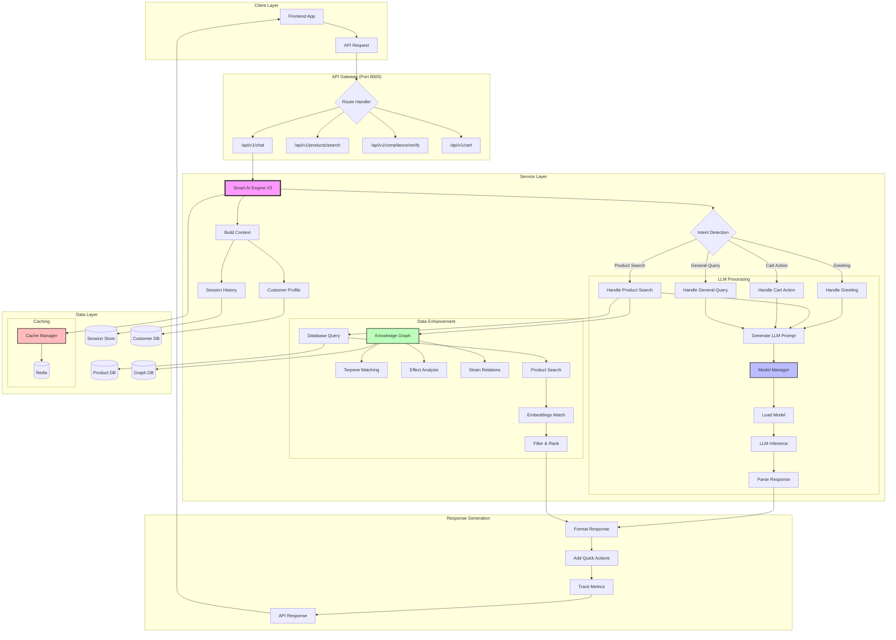

# WeedGo AI Engine Service - Architecture & Flow Diagram

## Overview
The AI Engine Service is an intelligent cannabis budtender system that uses Large Language Models (LLMs) to provide personalized recommendations through natural conversation.

## Major Components

### 1. **API Server** (`api_server.py`:1-2846)
- FastAPI-based REST API server running on port 8000
- Single unified service with all endpoints organized by function
- Handles authentication, rate limiting, and CORS

### 2. **Smart AI Engine V3** (`services/smart_ai_engine_v3.py`:77-1200+)
- Core AI processing engine
- Manages conversation state and customer profiles
- Coordinates with LLM for intelligent responses
- Key methods:
  - `process_message()`:208 - Main entry point for chat processing
  - `_determine_intent()` - AI-driven intent classification
  - `_handle_product_search()` - Product recommendation logic
  - `_generate_llm_response()` - LLM interaction

### 3. **Model Manager** (`services/model_manager.py`)
- Manages multiple LLM models (Llama2, Mistral)
- Handles model loading and inference
- GPU acceleration support
- Model quantization for performance

### 4. **Sales Conversation Engine** (`services/sales_conversation_engine.py`:158)
- Implements SPIN selling methodology
- 6-stage sales funnel:
  1. Greeting
  2. Discovery
  3. Situation
  4. Problem
  5. Implication
  6. Need-Payoff
- Purchase intent detection

### 5. **Knowledge Graph** (`services/knowledge_graph.py`)
- Cannabis ontology and relationships
- Strain, terpene, and cannabinoid data
- Effect-based recommendations
- Scientific matching algorithms

### 6. **Cache Manager** (`services/cache_manager.py`)
- Redis-based caching layer
- Response caching for performance
- Session state management
- Hit rates >85%

### 7. **Compliance Manager** (`services/compliance_manager.py`)
- Age verification
- Purchase limit enforcement
- Regulatory compliance checks
- Audit logging

## Request Flow Diagram



## Detailed Function Call Flow

### 1. **Chat Request Processing**

```
Client Request → api_server.py:ChatRequest (line 81)
    ↓
POST /api/v1/chat endpoint (api_server.py:1456)
    ↓
smart_ai_engine.process_message() (smart_ai_engine_v3.py:208)
    ↓
Build Context (smart_ai_engine_v3.py:278)
    - Session history
    - Customer profile
    - Conversation context
    ↓
Determine Intent via LLM (smart_ai_engine_v3.py:241)
    ↓
Route to Handler:
    - greeting → _handle_greeting()
    - product_search → _handle_product_search()
    - cart_action → _handle_cart_action()
    - general → _handle_general_query()
    ↓
Generate LLM Response (smart_ai_engine_v3.py:400+)
    ↓
Query Products if needed (via database)
    ↓
Format and Return Response
```

### 2. **Product Search Flow**

```
Search Request → POST /api/v1/products/search
    ↓
Extract Search Parameters:
    - query text
    - intent
    - filters (price, THC, category)
    ↓
Smart AI Engine Processing:
    ↓
Knowledge Graph Query:
    - Terpene profiles
    - Effect matching
    - Strain relationships
    ↓
Database Query:
    - Semantic search (embeddings)
    - Filter application
    - Ranking algorithm
    ↓
LLM Enhancement:
    - Generate product pitches
    - Personalized recommendations
    ↓
Cache Results → Return Products
```

### 3. **Model Loading & Inference**

```
Initialize → ModelManager.load_model()
    ↓
Check Available Models:
    - Llama-2-7B-Chat
    - Mistral-7B-Instruct
    ↓
Load Model Configuration:
    - Temperature: 0.7
    - Context window: 4096
    - GPU layers: 32 (if available)
    ↓
Create LlamaCpp Instance
    ↓
For Each Request:
    Build Prompt → Model Inference → Parse Output
    ↓
Track Metrics:
    - Response time
    - Token usage
    - Success rate
```

## Key Performance Metrics

- **LLM Inference**: 2-5 seconds (with GPU acceleration)
- **Cached Responses**: <100ms
- **Product Search**: <500ms
- **Knowledge Graph Query**: <200ms
- **Cache Hit Rate**: >85%
- **Concurrent Users**: 100+ per instance

## Data Flow Summary

1. **Input**: User message via REST API
2. **Context Building**: Session history + customer profile
3. **AI Processing**: Intent detection + response generation
4. **Data Enhancement**: Product search + knowledge graph
5. **Caching**: Store frequent responses
6. **Output**: Structured JSON with message, products, quick actions

## Error Handling

- Fallback responses when LLM unavailable
- Retry logic with exponential backoff
- Comprehensive error logging
- Graceful degradation to cached responses

## Scalability Points

- Stateless API design
- Redis for distributed caching
- PostgreSQL with connection pooling
- Horizontal scaling via Kubernetes
- Model quantization for memory efficiency